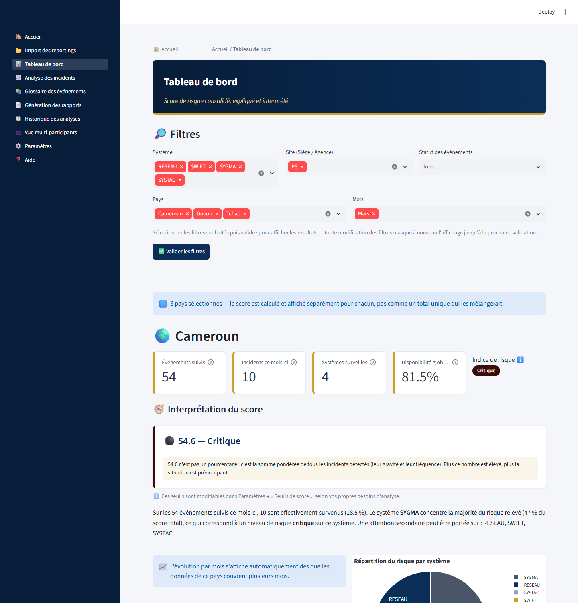
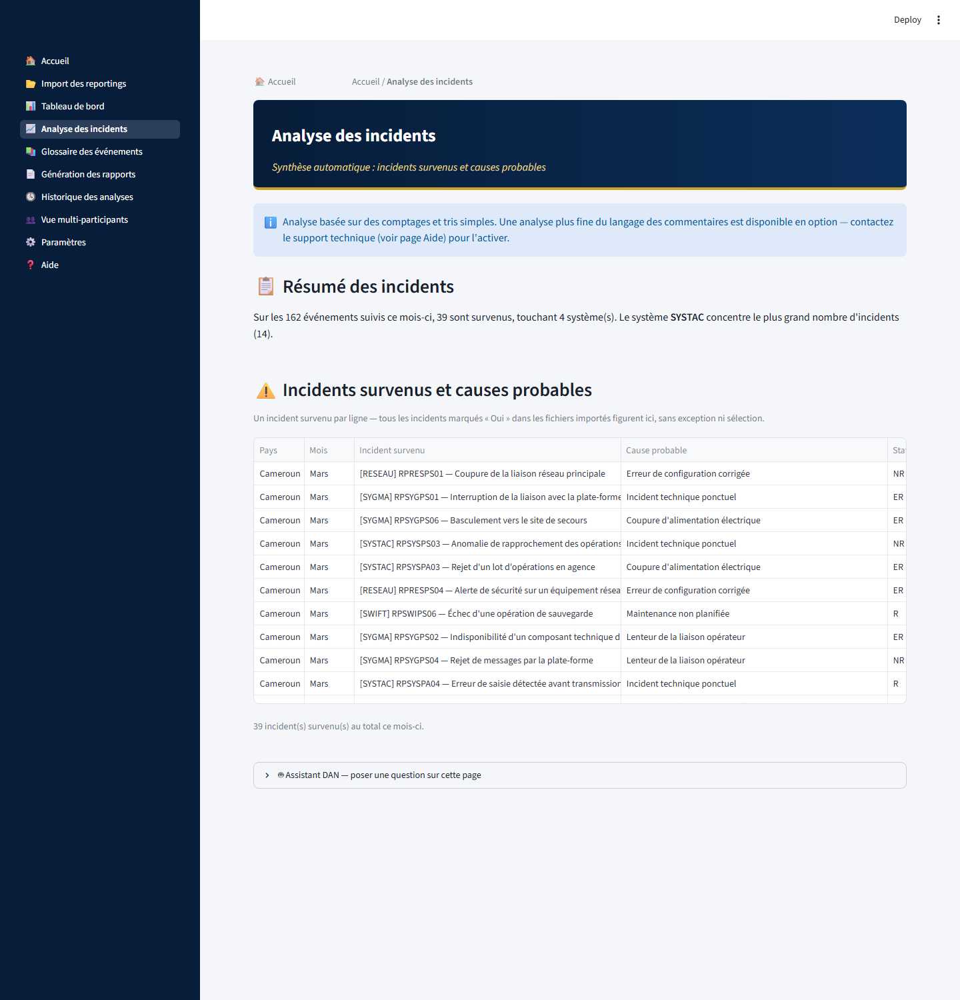
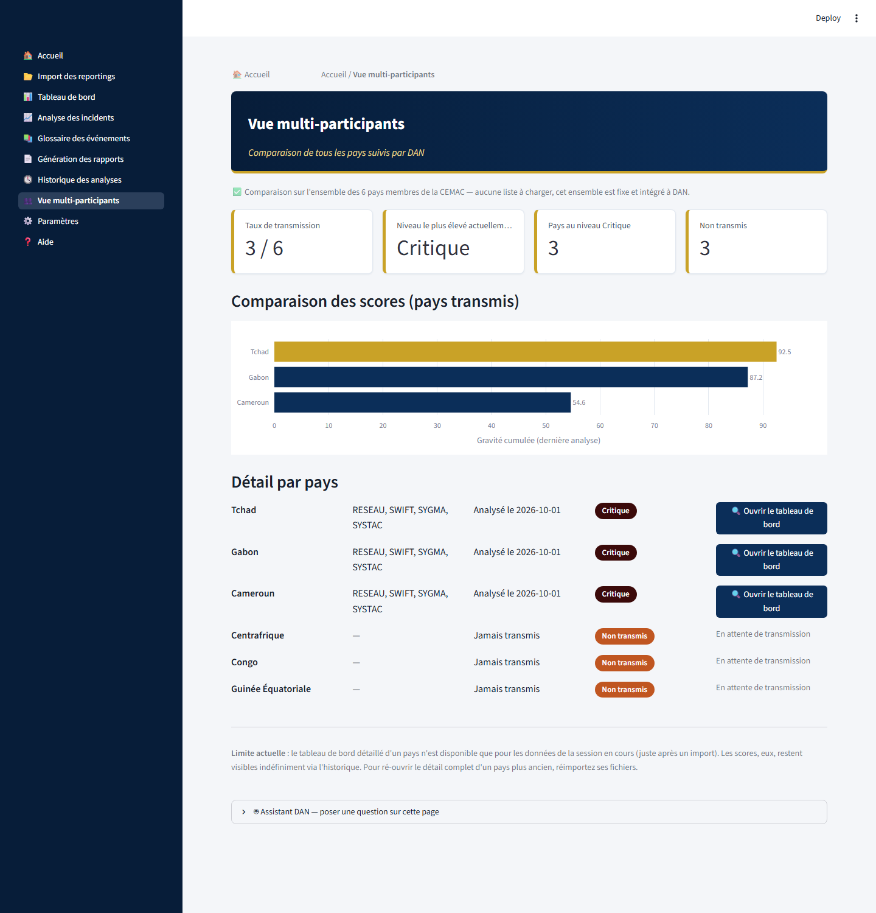

# DAN — Payment Systems Oversight Dashboard

[](https://github.com/Daniel-200600/dan-payment-risk-analysis/actions/workflows/tests.yml)


DAN is a Streamlit application that helps an oversight team turn monthly Excel
"reporting" forms, submitted by payment-system participants, into a risk score,
an incident analysis and ready-to-share Word/PDF reports.

> **Disclaimer.** This is an independent portfolio project. It is not an
> official product of, and is not endorsed by, any central bank or financial
> institution. All data, risk mappings, report templates, guides and logos in
> this repository are **synthetic placeholders** created for demonstration.
> No real transaction, participant or institutional data is included.

## Context and problem

Overseeing payment systems (large-value settlement, clearing, interbank
messaging, network infrastructure) means collecting periodic incident reports
from many participants across several countries, consolidating them, and
deciding where attention is needed. Doing this by hand in spreadsheets is slow
and inconsistent. DAN was built to explore how that workflow can be automated
with a transparent, explainable scoring approach.

## Objectives

- Ingest heterogeneous Excel reporting files with minimal manual preparation.
- Map reported events to risk categories and levels, and compute a consolidated,
  explainable severity score.
- Compare countries and systems, and track trends over time.
- Generate consolidated reports without manual copy-paste.

## Implemented features

- **Import** of `.xlsx` / `.xls` reporting forms, either as single files or as a
  whole folder. Country, month and year are inferred from the folder names
  (e.g. `Cameroun/MOIS MARS 2026/BANQUE_A/file.xlsx`) with tolerant matching of
  case, accents and abbreviations. The payment system is detected from the
  content of the reference codes (`RP` + system + site + number), with a
  filename fallback and warnings on inconsistent files.
- **Risk scoring**: severity = occurrence weight (logarithmic smoothing) x risk
  level weight, with combined risk categories (e.g. `RO+RJ`) split across
  categories. Absolute thresholds (Critical/High/Medium/Low) are configurable.
- **Dashboard** with consolidated score, per-system breakdown and plain-language
  interpretation.
- **Incident analysis**: occurred incidents, probable causes, dominant risks,
  rule-based recommendations and a proposed action plan.
- **Multi-country view** and **analysis history** (stored locally as JSON).
- **Report generation** from `.docx` templates (docxtpl): a consolidated incident
  report and a monthly activity report (response rate per country, status
  breakdown, charts). Word download, in-app preview, PDF via Word/LibreOffice
  when available or a native fallback.
- **Settings**: thresholds, expected participants per country, theme/colors,
  replacement of the risk mapping and guide with automatic versioned backups.
- **Optional assistant** using a local LLM through [Ollama](https://ollama.com)
  (disabled by default behavior if Ollama is not installed).

The user interface is in French.

## Architecture

```
Excel reportings --> logic/donnees.py (parsing, detection, scoring)
                          |
mapping_risques.xlsx -----+--> logic/interpretation.py, analyse_intelligente.py
                          |
                          +--> logic/rapports.py (docxtpl templates -> .docx/.pdf)
pages_dan/*.py (Streamlit pages) <-- logic/* ;  style.py (theme) ; dashboard.py (entry point)
```

Each Streamlit page is one module in `src/pages_dan/` exposing `afficher()`;
business logic lives in `src/logic/` and is independent of the UI, which makes
it unit-testable.

## Technologies

Python 3.11, Streamlit, pandas, NumPy, openpyxl/xlrd, python-docx, docxtpl,
matplotlib, plotly, reportlab, pytest. Optional: Ollama.

## Repository layout

```
src/
  dashboard.py        entry point (multi-page navigation)
  style.py, chemins.py
  logic/              parsing, scoring, history, reports, configuration
  pages_dan/          Streamlit pages
tests/                pytest suite
scripts/generate_demo_resources.py   regenerates all synthetic resources below
mapping/              synthetic risk mapping (27 illustrative events)
referentiels/         placeholder logo and generic guide
templates/            generic report templates
data/sample/          fictitious reporting forms (3 countries x 2 banks x 4 systems)
```

## Installation

```bash
python -m venv .venv
.venv\Scripts\activate          # Windows  (source .venv/bin/activate on Linux/macOS)
pip install -r requirements.txt
```

## Running

Run from the repository root (resource paths are relative to it):

```bash
streamlit run src/dashboard.py
```

## Usage example

1. Open **Import des reportings**.
2. Drop the folder `data/sample/` (or individual files from it).
3. Open **Tableau de bord** for the consolidated score, **Analyse des incidents**
   for causes and recommendations, then **Génération des rapports** to produce
   and download the Word reports.

To use DAN with your own data, replace `mapping/mapping_risques.xlsx`, the
templates and the logo with your own (the Settings page can replace the mapping
and guide with versioned backups). Do not commit real data: `data/processed/`,
`data/raw/` and `outputs/` are git-ignored.

## Tests

```bash
pip install -r requirements-dev.txt
pytest
```

## Screenshots

All screenshots use the synthetic sample data in `data/sample/`.

**Dashboard** — consolidated score per country, interpretation and risk breakdown by system



**Incident analysis** — occurred incidents and probable causes



**Multi-country view** — comparison of the tracked countries



## Known limitations

- French-only interface; single local user, no authentication.
- The scoring weights are heuristic and have not been validated against
  real-world outcomes.
- The risk mapping and templates shipped here are illustrative, not authoritative.
- `generer_rapport_docx` (per-file report) is not exposed in the UI and fails when
  the source file name contains folder segments.
- Mapping/guide backups are timestamped to the second, so two replacements in the
  same second overwrite one another (this can make one test flaky).
- Exact PDF output requires Microsoft Word or LibreOffice; otherwise a simplified
  native PDF is produced.
- Legacy exploration notebooks from the original project are not included.

## License

Released under the [MIT License](LICENSE).
